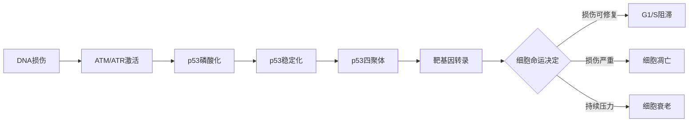



## 基本信息 | Basic Information

<div class="row">
  <div class="col-md-6">
    <h4>蛋白信息</h4>
    <ul class="list-unstyled">
      <li><strong>基因：</strong>TP53 (人类染色体17p13.1)</li>
      <li><strong>蛋白：</strong>393个氨基酸，~53 kDa</li>
      <li><strong>功能形式：</strong>同源四聚体</li>
      <li><strong>发现：</strong>1979年 (David Lane, Arnold Levine等)</li>
      <li><strong>诺奖相关：</strong>2024年诺贝尔生理学或医学奖关注p53研究</li>
    </ul>
  </div>
  <div class="col-md-6">
    <h4>临床意义</h4>
    <ul class="list-unstyled">
      <li><strong>突变频率：</strong>50%人类癌症</li>
      <li><strong>Li-Fraumeni综合征：</strong>种系突变</li>
      <li><strong>治疗靶点：</strong>高价值但传统"不可成药"</li>
      <li><strong>预后标志：</strong>p53状态影响治疗响应</li>
    </ul>
  </div>
</div>

---

## 结构域组成 | Domain Architecture



### 线性结构

```
N端 [1]-----[67]----[98]----[303]--[323]--[363]-------[393] C端
     ↓        ↓       ↓        ↓      ↓      ↓          ↓
     TAD1/2   PRD     DBD      LS    TD     REG         CTD
```

### 各结构域详解

#### 1. TAD (Transactivation Domain, 1-67 aa)
- **TAD1 (1-40)：** 主要转录激活区域
- **TAD2 (40-67)：** 辅助激活区域
- **功能：** 招募转录共激活因子（CBP/p300, TFIID）
- **修饰：** 磷酸化、乙酰化调控活性
- **相分离：** 富含芳香族残基，驱动凝聚体形成

#### 2. PRD (Proline-Rich Domain, 67-98 aa)
- **特点：** 富含脯氨酸 (PXXP motifs)
- **功能：** 
  - 结合SH3结构域蛋白
  - 调控凋亡
  - 影响p53稳定性

#### 3. DBD (DNA-Binding Domain, 98-303 aa)
**核心结构：**
- β-sandwich + loop-sheet-helix
- 锌离子配位稳定结构
- 识别共有序列：5'-PuPuPuC(A/T)(A/T)GPyPyPy-3'

**热点突变区域：**
- **R175H：** 接触突变（contact mutation）
- **R248Q/W：** 结构突变（structural mutation）
- **R273H：** 接触突变
- **G245S：** 接触突变
- **R282W：** 结构突变

这5个位点占所有p53突变的~30%

#### 4. Linker (LS, 303-323 aa)
- 连接DBD和四聚化结构域
- 柔性区域，允许DNA结合的构象变化

#### 5. TD (Tetramerization Domain, 323-363 aa)
**结构：**
- 二聚化：β-strand + α-helix
- 四聚化：两个二聚体的二聚
- 极其稳定 (Kd ~ pM)

**功能：**
- 必需用于DNA结合
- 稳定p53蛋白
- 调控细胞定位

#### 6. REG (Regulatory Domain, 363-393 aa)
也称为CTD (C-Terminal Domain)

**功能：**
- 负调控DNA结合特异性
- 响应应激信号
- 介导非特异性DNA结合
- 参与相分离

**修饰位点：**
- 乙酰化：K370, K372, K373, K381, K382
- 甲基化：K370, K372
- 泛素化：K370, K372, K373, K381, K382

---

## 功能机制 | Function & Mechanism

### 1. DNA损伤响应



**关键步骤：**
1. **应激信号：** DNA双链断裂、氧化应激、致癌基因激活
2. **磷酸化级联：**
   - ATM/ATR磷酸化p53 Ser15
   - 阻断MDM2结合
   - p53蛋白稳定累积
3. **转录激活：**
   - 细胞周期：p21 (CDK抑制剂)
   - 凋亡：PUMA, NOXA, BAX
   - 修复：GADD45, XPC
   - 代谢：TIGAR, SCO2

### 2. 靶基因识别

**p53响应元件 (p53RE)：**
```
5'- RRRCWWGYYY (n0-13) RRRCWWGYYY -3'
    (R=A/G, W=A/T, Y=C/T)
```

**结合模式：**
- 四聚体结合两个半位点（每个10 bp）
- 两个半位点间距0-13 bp（通常0-2 bp）
- 每个单体识别1/4位点

**全基因组结合特征：**
- ChIP-seq鉴定出~1000-5000个结合位点
- 仅10-20%位点导致基因激活
- 染色质状态影响p53占据

### 3. 与组蛋白的竞争



**竞争的物理基础：**

| 因素 | 组蛋白 | p53 |
|------|-------|-----|
| **DNA结合亲和力** | 非特异性，高亲和 | 序列特异性，中等亲和 |
| **细胞浓度** | ~10 μM (大量) | ~10 nM (基础) → ~1 μM (应激) |
| **空间占据** | 147 bp DNA缠绕 | ~20 bp识别 |
| **动态性** | 核小体呼吸 (~250 ms) | 快速结合-解离 |

**竞争机制：**
1. **基础状态：** 染色质紧密，p53难以接近
2. **应激激活：**
   - p53蛋白大量累积
   - 染色质重塑酶被招募
   - 组蛋白修饰改变（乙酰化）
3. **动态竞争：**
   - 利用核小体呼吸瞬间
   - 先锋转录因子辅助
   - 相分离增强局部浓度

**实验证据：**
- 体外EMSA：组蛋白抑制p53-DNA结合
- 单分子FRET：核小体展开促进p53结合
- ChIP-seq：p53优先结合开放染色质区域

---

## 相分离与转录凝聚体 | LLPS & Transcriptional Condensates

### p53的相分离行为



**分子基础：**
- **TAD (N端)：** 富含芳香族残基 (Phe, Tyr, Trp) → π-π相互作用
- **CTD (C端)：** 带负电，静电相互作用
- **IDR (intrinsically disordered regions)：** 低复杂度序列

**相分离的功能：**

1. **浓缩效应：**
   - 局部p53浓度 >>  体相浓度
   - 增强DNA结合
   - 招募共激活因子

2. **选择性分配：**
   - 分离转录相关因子
   - 排除抑制因子
   - 提高转录效率

3. **动态调控：**
   - 磷酸化溶解凝聚体
   - 乙酰化调控相分离阈值

**实验观察：**
- 体外重构：p53在拥挤剂 (PEG) 中形成液滴
- 细胞内成像：DNA损伤后p53形成核内病灶
- FRAP实验：凝聚体具有流动性 (t₁/₂ ~ 10-30 s)

### MYC-p53 Sequential Remodeling

🚀 **进行中的研究：**

**科学假说：**
- 正常增殖：MYC凝聚体主导 → 增殖基因激活
- 复制应激：R-loop形成 → DNA损伤信号
- 状态转换：MYC凝聚体解体，p53凝聚体形成
- 修复状态：p53凝聚体主导 → 修复基因激活

**实验策略：**
1. **体内成像** (万老师)：活细胞观察MYC/p53凝聚体动态
2. **体外单分子** (孙玉婷)：纳米流体 + 拥挤剂模拟竞争
3. **定量整合**：建立跨尺度预测模型

---

## 突变与癌症 | Mutations & Cancer

### 突变类型

#### 1. 失活突变 (Loss-of-Function, LOF)
最常见，~75%

**机制：**
- 破坏DNA结合能力
- 破坏四聚化
- 破坏蛋白稳定性

**热点：**
- R175H, R248Q/W, R273H, R282W (DBD)
- R337H (TD)

#### 2. 显性负性突变 (Dominant-Negative, DN)
- 突变型p53与野生型形成混合四聚体
- 抑制残存野生型p53功能
- 预后更差

#### 3. 功能获得突变 (Gain-of-Function, GOF)
约10-30%

**新功能：**
- 促进细胞迁移与侵袭
- 抑制p63/p73 (p53家族成员)
- 改变转录程序（结合新靶基因）
- 干扰DNA修复

**分子机制：**
- 突变型p53与其他转录因子相互作用
- 结合非经典DNA序列
- 形成异常蛋白聚集体

### 癌症类型与p53状态

| 癌症类型 | p53突变频率 | 常见突变 |
|---------|-----------|---------|
| 卵巢癌 | ~96% | R175H, R248Q, R273H |
| 结直肠癌 | ~50% | R248Q/W, R175H, R273H |
| 肺癌 | ~50% | R248Q/W, R273H |
| 乳腺癌 | ~30% | R175H, R248Q, R273H |
| 胰腺癌 | ~75% | R175H, R248Q/W, R273H |
| 前列腺癌 | ~15% | 相对低频，晚期升高 |

---

## 治疗策略 | Therapeutic Strategies

### 1. 恢复野生型p53功能

#### 小分子化合物
- **APR-246 (PRIMA-1MET)：** 
  - 机制：恢复突变型p53构象
  - 临床：III期临床试验（骨髓增生异常综合征）
  
- **COTI-2：**
  - 稳定突变型p53的活性构象
  - 临床：I/II期试验

#### 基因治疗
- **Ad-p53 (Gendicine)：**
  - 腺病毒载体递送野生型p53
  - 中国批准用于头颈癌（2003年）

### 2. 阻断p53-MDM2相互作用

**适用：** 保留野生型p53的肿瘤

**MDM2抑制剂：**
- **Nutlin-3a：** 原型化合物（研究工具）
- **RG7112：** 临床I期
- **AMG 232：** 临床II期
- **Idasanutlin (RG7388)：** 临床III期（急性髓系白血病）

**机制：**
- 竞争性抑制MDM2-p53结合
- 阻止p53泛素化降解
- p53蛋白累积 → 诱导凋亡

### 3. 靶向p53下游通路

- **细胞周期：** CDK4/6抑制剂 (palbociclib)
- **凋亡：** BCL-2抑制剂 (venetoclax)
- **代谢：** 靶向p53调控的代谢酶

### 4. 合成致死策略

**p53缺失 + 其他基因靶向：**
- **ATR抑制剂：** 利用复制压力
- **CHK1抑制剂：** 去除G2/M检查点
- **WEE1抑制剂：** 细胞周期调控

**基本原理：**
```
野生型p53肿瘤：G1检查点正常，可容忍G2/M检查点缺失
p53突变肿瘤：G1检查点失效，依赖G2/M检查点
              → 抑制G2/M检查点导致选择性杀伤
```

---

## 研究方法 | Research Methods

### 生化与细胞生物学

```yaml
Western Blot:
  用途: p53蛋白表达水平
  抗体: DO-1, PAb1801 (构象特异性)
  
Co-IP (Co-Immunoprecipitation):
  用途: p53蛋白相互作用
  伴侣: MDM2, CBP/p300, p63/p73
  
EMSA:
  用途: p53-DNA结合活性
  探针: 包含p53RE的DNA片段
  
Luciferase Assay:
  用途: p53转录活性
  报告基因: p53RE-Luc
```

### 基因组学

**ChIP-seq (Chromatin Immunoprecipitation Sequencing):**
- 全基因组p53结合位点
- 发现：~5000个结合位点，仅~500个活性增强子
- 数据库：ENCODE, GTRD

**RNA-seq:**
- p53调控的基因表达谱
- 野生型 vs 突变型 p53的转录差异
- 单细胞RNA-seq: p53异质性

### 单分子技术



#### 1. FRET (Förster Resonance Energy Transfer)
**应用：**
- p53-DNA结合动态
- p53构象变化
- p53-MDM2相互作用实时监测

**实验设计：**
```
Donor (Cy3): p53 DBD
Acceptor (Cy5): DNA
↓
E_FRET = 0.6 → 结合状态
E_FRET = 0 → 解离状态
```

#### 2. CoSMoS (Co-localization Single-Molecule Spectroscopy)
**应用：**
- p53四聚体组装动力学
- p53-共激活因子招募
- 多蛋白复合物动态

#### 3. Nanofluidics
**用于p53-组蛋白竞争研究：**
- 空间限域模拟核内环境
- 控制分子拥挤条件 (PEG 0-300 mg/mL)
- 通道尺寸：50 nm - 2 μm

**实验参数：**
```
DNA: λ-DNA或p53靶基因序列
蛋白浓度: 
  - 组蛋白：0.1-1 μM
  - p53：10 nM - 1 μM
拥挤剂: PEG 8000 (0-300 mg/mL)
```

#### 4. LLPS Assays
**体外相分离重构：**
- 纯化p53蛋白
- 拥挤剂（PEG或Ficoll）
- 盐浓度、pH优化
- 浊度测量、DIC显微镜、荧光成像

---

## 研究热点与前沿 | Current Trends

### 🔥 2023-2025 重要进展

1. **突变型p53聚集体** (Nature 2023)
   - 突变型p53形成淀粉样纤维聚集体
   - 聚集体隔离野生型p53/p63/p73
   - 新治疗策略：解聚剂

2. **p53相分离新机制** (Cell 2024)
   - 磷酸化调控相分离
   - 相分离驱动基因选择性激活
   - 相分离缺陷与癌症

3. **p53-铁死亡** (Nature 2024)
   - p53调控脂质过氧化
   - SLC7A11抑制导致铁死亡
   - 新治疗窗口

4. **p53-微生物组** (Science 2023)
   - 肠道菌影响p53活性
   - 菌群代谢物调控p53
   - p53突变影响菌群组成

### 🎯 未来方向

1. **蛋白质降解靶向（PROTAC）:**
   - 降解突变型p53
   - 选择性降解而非抑制

2. **CRISPR基因编辑：**
   - 修复p53突变
   - 体内基因编辑的可行性

3. **人工智能辅助药物设计：**
   - AlphaFold预测突变型p53结构
   - 虚拟筛选新化合物

4. **表观遗传重编程：**
   - 恢复p53靶基因的染色质可及性
   - HDAC抑制剂联合治疗

---

## 相关蛋白 | Related Proteins

<div class="row">
  <div class="col-md-4">
    <div class="card">
      <div class="card-body">
        <h5 class="card-title">p53家族</h5>
        <ul class="small">
          <li><strong>p63:</strong> 上皮发育</li>
          <li><strong>p73:</strong> 神经发育</li>
          <li>共享DBD，结合相似序列</li>
        </ul>
      </div>
    </div>
  </div>
  <div class="col-md-4">
    <div class="card">
      <div class="card-body">
        <h5 class="card-title">调控蛋白</h5>
        <ul class="small">
          <li><strong>MDM2:</strong> E3泛素连接酶</li>
          <li><strong>MDM4:</strong> 抑制p53活性</li>
          <li><strong>ATM/ATR:</strong> DNA损伤激酶</li>
        </ul>
      </div>
    </div>
  </div>
  <div class="col-md-4">
    <div class="card">
      <div class="card-body">
        <h5 class="card-title">竞争蛋白</h5>
        <ul class="small">
          <li><a href="../../structural/histones/">Histones</a></li>
          <li><a href="../../regulatory/myc/">MYC</a></li>
          <li>先锋转录因子</li>
        </ul>
      </div>
    </div>
  </div>
</div>

---

## 参考文献 | Key References

### 里程碑文献

1. **Lane & Crawford (1979)** *Nature* 278:261-263
   - 首次发现p53蛋白

2. **Vogelstein et al. (2000)** *Nature* 408:307-310
   - p53与癌症全面综述

3. **Kastenhuber & Lowe (2017)** *Cell* 170:1062-1078
   - p53功能与治疗策略

### 相分离相关

4. **Chong et al. (2018)** *Nat Chem* 10:1214-1223
   - p53相分离基本原理

5. **Sabari et al. (2018)** *Science* 361:eaar3958
   - 转录凝聚体形成机制

### 最新进展

6. **Schulz-Heddergott et al. (2023)** *Nature* 617:338-346
   - 突变型p53聚集体

7. **Liu et al. (2024)** *Cell* 187:xxx
   - p53相分离与基因选择性

---

## 在线资源 | Online Resources

### 数据库
- [p53 Mutation Database](https://p53.fr/) - IARC维护的p53突变数据库
- [COSMIC](https://cancer.sanger.ac.uk/cosmic) - 癌症体细胞突变数据
- [ClinVar](https://www.ncbi.nlm.nih.gov/clinvar/) - 临床相关突变

### 结构
- [PDB: 1TSR](https://www.rcsb.org/structure/1TSR) - p53 DBD-DNA复合物
- [PDB: 1C26](https://www.rcsb.org/structure/1C26) - p53 Tetramerization domain

### 教学资源
- [p53 and Cancer - iBiology](https://www.ibiology.org/)
- [Cancer Genome Atlas](https://www.cancer.gov/tcga)

---

<div class="alert alert-success">
  <strong>✅ 本页面状态：</strong>已完成基础内容 | 持续更新p53-组蛋白竞争和相分离相关研究 | Last updated: 2025-01-15
</div>
